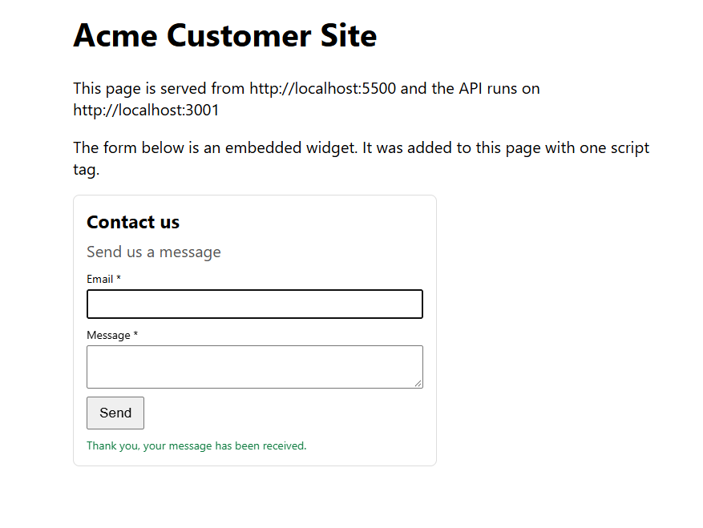
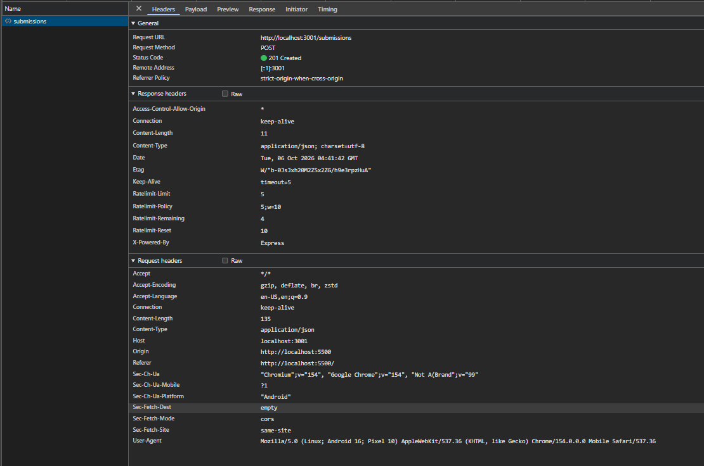
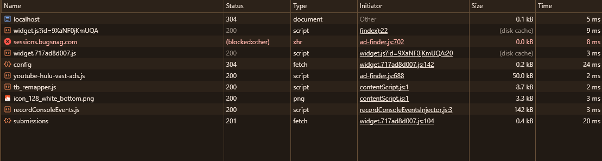

# Evidence

Tokens are replaced by the shell variables $TOKEN_A and $TOKEN_B (two different owners). Owner A created widget 9XaNF0jKmUQA.

## Widget management

### Authenticated CRUD endpoints; requests without valid auth are rejected

Create a widget as owner A:

```text
curl -s -X POST http://localhost:3001/api/widgets -H "Content-Type: application/json" -H "Authorization: Bearer $TOKEN_A" -d '{"type":"contact","title":"Contact us","description":"Send us a message","buttonText":"Send","fields":[{"name":"email","label":"Email","type":"email","required":true},{"name":"message","label":"Message","type":"textarea","required":true}]}'
```

```text
{"id":"9XaNF0jKmUQA","type":"contact","title":"Contact us","description":"Send us a message","buttonText":"Send","fields":[{"name":"email","type":"email","label":"Email","required":true},{"name":"message","type":"textarea","label":"Message","required":true}],"displayOptions":{},"version":1,"createdAt":"2026-10-06T01:44:38.720Z","updatedAt":"2026-10-06T01:44:38.720Z","embedSnippet":"<script src=\"http://localhost:3001/widget.js?id=9XaNF0jKmUQA\"></script>"}
```

Request without a token is rejected:

```text
curl -s -w "\nHTTP %{http_code}\n" http://localhost:3001/api/widgets
```

```text
{"error":"Missing or invalid token"}
HTTP 401
```

List as owner A:

```text
curl -s -w "\nHTTP %{http_code}\n" http://localhost:3001/api/widgets -H "Authorization: Bearer $TOKEN_A"
```

```text
[{"id":"9XaNF0jKmUQA","type":"contact","title":"Contact us","description":"Send us a message","buttonText":"Send","fields":[{"name":"email","type":"email","label":"Email","required":true},{"name":"message","type":"textarea","label":"Message","required":true}],"displayOptions":{},"version":1,"createdAt":"2026-10-06T01:44:38.720Z","updatedAt":"2026-10-06T01:44:38.720Z","embedSnippet":"<script src=\"http://localhost:3001/widget.js?id=9XaNF0jKmUQA\"></script>"}]
HTTP 200
```

Read as owner A:

```text
curl -s -w "\nHTTP %{http_code}\n" http://localhost:3001/api/widgets/9XaNF0jKmUQA -H "Authorization: Bearer $TOKEN_A"
```

```text
{"id":"9XaNF0jKmUQA","type":"contact","title":"Contact us","description":"Send us a message","buttonText":"Send","fields":[{"name":"email","type":"email","label":"Email","required":true},{"name":"message","type":"textarea","label":"Message","required":true}],"displayOptions":{},"version":1,"createdAt":"2026-10-06T01:44:38.720Z","updatedAt":"2026-10-06T01:44:38.720Z","embedSnippet":"<script src=\"http://localhost:3001/widget.js?id=9XaNF0jKmUQA\"></script>"}
HTTP 200
```

Update as owner A (version goes from 1 to 2):

```text
curl -s -w "\nHTTP %{http_code}\n" -X PUT http://localhost:3001/api/widgets/9XaNF0jKmUQA -H "Content-Type: application/json" -H "Authorization: Bearer $TOKEN_A" -d '{"type":"contact","title":"Contact us","description":"Send us a message","buttonText":"Send","fields":[{"name":"email","label":"Email","type":"email","required":true},{"name":"message","label":"Message","type":"textarea","required":true}]}'
```

```text
{"id":"9XaNF0jKmUQA","type":"contact","title":"Contact us","description":"Send us a message","buttonText":"Send","fields":[{"name":"email","type":"email","label":"Email","required":true},{"name":"message","type":"textarea","label":"Message","required":true}],"displayOptions":{},"version":2,"createdAt":"2026-10-06T01:44:38.720Z","updatedAt":"2026-10-06T01:46:39.129Z","embedSnippet":"<script src=\"http://localhost:3001/widget.js?id=9XaNF0jKmUQA\"></script>"}
HTTP 200
```

Invalid payload is rejected with a clean 4xx:

```text
curl -s -w "\nHTTP %{http_code}\n" -X POST http://localhost:3001/api/widgets -H "Content-Type: application/json" -H "Authorization: Bearer $TOKEN_A" -d '{"type":"bad"}'
```

```text
{"error":"Invalid widget payload"}
HTTP 400
```

Create a temporary widget, delete it, then read it again:

```text
TMP_ID=$(curl -s -X POST http://localhost:3001/api/widgets -H "Content-Type: application/json" -H "Authorization: Bearer $TOKEN_A" -d '{"type":"cta","title":"Temp"}' | grep -o '"id":"[^"]*"' | cut -d'"' -f4)
echo $TMP_ID
curl -s -w "HTTP %{http_code}\n" -X DELETE http://localhost:3001/api/widgets/$TMP_ID -H "Authorization: Bearer $TOKEN_A"
curl -s -w "\nHTTP %{http_code}\n" http://localhost:3001/api/widgets/$TMP_ID -H "Authorization: Bearer $TOKEN_A"
```

```text
p08EQ7PllaOY
HTTP 204
{"error":"Widget not found"}
HTTP 404
```

### Multi-tenant isolation: tenant A cannot read or modify tenant B's widgets or submissions

Owner B reads owner A's widget:

```text
curl -s -w "\nHTTP %{http_code}\n" http://localhost:3001/api/widgets/9XaNF0jKmUQA -H "Authorization: Bearer $TOKEN_B"
```

```text
{"error":"Widget not found"}
HTTP 404
```

Owner B updates owner A's widget:

```text
curl -s -w "\nHTTP %{http_code}\n" -X PUT http://localhost:3001/api/widgets/9XaNF0jKmUQA -H "Content-Type: application/json" -H "Authorization: Bearer $TOKEN_B" -d '{"type":"contact","title":"Hacked"}'
```

```text
{"error":"Widget not found"}
HTTP 404
```

Owner B deletes owner A's widget:

```text
curl -s -w "\nHTTP %{http_code}\n" -X DELETE http://localhost:3001/api/widgets/9XaNF0jKmUQA -H "Authorization: Bearer $TOKEN_B"
```

```text
{"error":"Widget not found"}
HTTP 404
```

Owner B lists widgets and sees only the one B created itself (KE_dFrE5YI0Y), not A's widget:

```text
curl -s -w "\nHTTP %{http_code}\n" http://localhost:3001/api/widgets -H "Authorization: Bearer $TOKEN_B"
```

```text
[{"id":"KE_dFrE5YI0Y","type":"contact","title":"Contact us","description":"","buttonText":"Submit","fields":[{"name":"email","type":"email","label":"Email","required":true},{"name":"message","type":"textarea","label":"Message","required":true}],"displayOptions":{},"version":1,"createdAt":"2026-10-06T01:31:46.003Z","updatedAt":"2026-10-06T01:31:46.003Z","embedSnippet":"<script src=\"http://localhost:3001/widget.js?id=KE_dFrE5YI0Y\"></script>"}]
HTTP 200
```

Submission isolation is proven later, in the dashboard section.

### Embed snippet generated per widget

Every widget response includes the field embedSnippet. From the create output above:

```text
<script src="http://localhost:3001/widget.js?id=9XaNF0jKmUQA"></script>
```

## Public submission API

All requests below come from `scripts/test-submissions.sh`. The widget id is 9XaNF0jKmUQA (owner A). The header Origin: <http://localhost:5500> simulates a customer site on a different origin.

### Cross-origin submissions work: CORS headers correct, preflight (OPTIONS) handled

```text
curl -s -i -X OPTIONS http://localhost:3001/submissions -H "Origin: http://localhost:5500" -H "Access-Control-Request-Method: POST" -H "Access-Control-Request-Headers: content-type"
```

```text
HTTP/1.1 204 No Content
X-Powered-By: Express
Access-Control-Allow-Origin: *
Access-Control-Allow-Methods: POST,OPTIONS
Access-Control-Allow-Headers: Content-Type
Access-Control-Max-Age: 600
Content-Length: 0
Date: Tue, 06 Oct 2026 01:59:59 GMT
Connection: keep-alive
Keep-Alive: timeout=5
```

```text
curl -s -i -X POST http://localhost:3001/submissions -H "Content-Type: application/json" -H "Origin: http://localhost:5500" -d '{"widgetId":"9XaNF0jKmUQA","data":{"email":"visitor@example.com","message":"Hello from another origin"}}'
```

```text
HTTP/1.1 201 Created
X-Powered-By: Express
Access-Control-Allow-Origin: *
Content-Type: application/json; charset=utf-8
Content-Length: 10
ETag: W/"a-vKxK8YqO9ibwq6Pqmm+U51mLrC4"
Date: Tue, 06 Oct 2026 01:59:59 GMT
Connection: keep-alive
Keep-Alive: timeout=5

{"id":"2"}
```

### All incoming input validated: malformed and oversized payloads rejected with 4xx and JSON errors

Invalid email:

```text
curl -s -w "\nHTTP %{http_code}\n" -X POST http://localhost:3001/submissions -H "Content-Type: application/json" -d '{"widgetId":"9XaNF0jKmUQA","data":{"email":"not-an-email"}}'
```

```text
{"error":"Invalid form data"}
HTTP 400
```

Field that the widget does not define:

```text
curl -s -w "\nHTTP %{http_code}\n" -X POST http://localhost:3001/submissions -H "Content-Type: application/json" -d '{"widgetId":"9XaNF0jKmUQA","data":{"email":"a@b.com","message":"x","extra":"y"}}'
```

```text
{"error":"Invalid form data"}
HTTP 400
```

Unknown widget:

```text
curl -s -w "\nHTTP %{http_code}\n" -X POST http://localhost:3001/submissions -H "Content-Type: application/json" -d '{"widgetId":"unknown","data":{}}'
```

```text
{"error":"Widget not found"}
HTTP 404
```

Malformed JSON:

```text
curl -s -w "\nHTTP %{http_code}\n" -X POST http://localhost:3001/submissions -H "Content-Type: application/json" -d '{"bad json'
```

```text
{"error":"Malformed JSON"}
HTTP 400
```

Oversized payload (a 20000 character message, the body limit is 10kb):

```text
curl -s -w "\nHTTP %{http_code}\n" -X POST http://localhost:3001/submissions -H "Content-Type: application/json" -d "{\"widgetId\":\"9XaNF0jKmUQA\",\"data\":{\"email\":\"a@b.com\",\"message\":\"$BIG\"}}"
```

```text
{"error":"Payload too large"}
HTTP 413
```

### Valid submissions stored safely, linked to the right widget and tenant

```text
docker compose exec -T db psql -U widget -d widgets -P pager=off -c "select id, widget_id, owner_id, data, ip from submissions;"
```

```text
 id |  widget_id   |               owner_id               |                                   data                                   | ip  
----+--------------+--------------------------------------+--------------------------------------------------------------------------+-----
  1 | 9XaNF0jKmUQA | 3557ac2f-1dd3-4ea9-9c7e-aa0f2bd157f7 | {"email": "visitor@example.com", "message": "Hello from another origin"} | ::1
  2 | 9XaNF0jKmUQA | 3557ac2f-1dd3-4ea9-9c7e-aa0f2bd157f7 | {"email": "visitor@example.com", "message": "Hello from another origin"} | ::1
(2 rows)
```

Only the valid submissions were stored. Every rejected request above left no row. The owner_id is copied from the widget, not from the request.

## Abuse protection

All requests below come from `scripts/test-abuse.sh`. The limit is 5 submissions per 10 seconds for one IP on one widget, plus 60 per minute for one IP across all widgets.

### Rate limiting per IP and per widget returns 429 under a burst, and the API keeps serving legitimate traffic

Burst of 12 rapid submissions to widget 9XaNF0jKmUQA (status codes in order):

```text
201 201 201 201 201 429 429 429 429 429 429 429 
```

One rejected request in detail (it still carries the CORS header, so a browser can read the error):

```text
HTTP/1.1 429 Too Many Requests
X-Powered-By: Express
Access-Control-Allow-Origin: *
RateLimit-Policy: 5;w=10
RateLimit-Limit: 5
RateLimit-Remaining: 0
RateLimit-Reset: 10
Retry-After: 10
Content-Type: application/json; charset=utf-8
Content-Length: 29
ETag: W/"1d-ixoIu9etr4N1apujqUUt8TNktbw"
Date: Tue, 06 Oct 2026 02:21:56 GMT
Connection: keep-alive
Keep-Alive: timeout=5

{"error":"Too many requests"}
```

Right after the burst, a submission to another widget and the health endpoint still succeed:

```text
{"id":"8"}
HTTP 201
{"status":"ok"}
HTTP 200
```

After the 10 second window passes, the burst widget accepts submissions again:

```text
{"id":"9"}
HTTP 201
```

### At least one spam-prevention technique demonstrably blocks a spam submission (honeypot field)

A submission with the hidden honeypot field filled in, like a bot would do. The response looks like a success, but no row is stored:

```text
rows before:
9
{"id":"0"}
HTTP 201
rows after:
9
```

Stored rows by email after all tests: the 5 burst submissions that were accepted are there, <bot@example.com> is not:

```text
        email        | count 
---------------------+-------
 burst@example.com   |     5
 normal@example.com  |     1
 other@example.com   |     1
 visitor@example.com |     2
(4 rows)
```

## Enrichment and safe side effects

### IP to geo enrichment uses a provider fallback chain: provider A down, provider B answers, submission enriched

The geo providers are mocked (GEO_MODE=mock) so the result is deterministic. The mock provider A answers with Mockland A and the mock provider B answers with Mockland B. The request header X-Mock-Geo-Down switches a mock provider off for that request. All requests below come from `scripts/test-geo.sh`.

Provider A up, enriched by provider A:

```text
curl -s -w "\nHTTP %{http_code}\n" -X POST http://localhost:3001/submissions -H "Content-Type: application/json" -d '{"widgetId":"9XaNF0jKmUQA","data":{"email":"geo-a@example.com","message":"provider A answers"}}'
```

```text
{"id":"10"}
HTTP 201
```

Provider A down, enriched by provider B:

```text
curl -s -w "\nHTTP %{http_code}\n" -X POST http://localhost:3001/submissions -H "Content-Type: application/json" -H "X-Mock-Geo-Down: a" -d '{"widgetId":"9XaNF0jKmUQA","data":{"email":"geo-b@example.com","message":"provider A down"}}'
```

```text
{"id":"11"}
HTTP 201
```

### All providers down: submission still succeeds without geo (degrade, never fail)

```text
curl -s -w "\nHTTP %{http_code}\n" -X POST http://localhost:3001/submissions -H "Content-Type: application/json" -H "X-Mock-Geo-Down: a,b" -d '{"widgetId":"9XaNF0jKmUQA","data":{"email":"geo-none@example.com","message":"all providers down"}}'
```

```text
{"id":"12"}
HTTP 201
```

Stored rows for the three requests. Row 10 was enriched by A, row 11 by B, row 12 has no geo:

```text
docker compose exec -T db psql -U widget -d widgets -P pager=off -c "select id, data->>'email' as email, country, city from submissions where data->>'email' like 'geo-%' order by id;"
```

```text
 id |        email         |  country   |    city    
----+----------------------+------------+------------
 10 | geo-a@example.com    | Mockland A | Alpha City
 11 | geo-b@example.com    | Mockland B | Beta City
 12 | geo-none@example.com |            | 
(3 rows)
```

### A failing confirmation email does not prevent the submission from being stored

The email is sent by a background job after the row is stored. The job tries 3 times, and logs an ALERT if all attempts fail. The header X-Mock-Email-Fail: true forces the mock email provider to fail for that request. All requests below come from `scripts/test-sideeffect.sh`.

Normal submission, the email works. The response comes back in about 0.05 seconds:

```text
curl -s -w "\nHTTP %{http_code} in %{time_total}s\n" -X POST http://localhost:3001/submissions -H "Content-Type: application/json" -d '{"widgetId":"9XaNF0jKmUQA","data":{"email":"side-ok@example.com","message":"email works"}}'
```

```text
{"id":"13"}
HTTP 201 in 0.050484s
```

Submission with the email forced to fail. The response is still 201 and comes back in about 0.007 seconds, so the failing job and its retries do not slow down or break the request:

```text
curl -s -w "\nHTTP %{http_code} in %{time_total}s\n" -X POST http://localhost:3001/submissions -H "Content-Type: application/json" -H "X-Mock-Email-Fail: true" -d '{"widgetId":"9XaNF0jKmUQA","data":{"email":"side-fail@example.com","message":"email fails"}}'
```

```text
{"id":"14"}
HTTP 201 in 0.007451s
```

Both rows are stored:

```text
docker compose exec -T db psql -U widget -d widgets -P pager=off -c "select id, data->>'email' as email from submissions where data->>'email' like 'side-%' order by id;"
```

```text
 id |         email         
----+-----------------------
 13 | side-ok@example.com
 14 | side-fail@example.com
(2 rows)
```

Server log for the two requests. Submission 13 sent its email. Submission 14 failed 3 times and raised an ALERT:

```text
EMAIL sent to owner 3557ac2f-1dd3-4ea9-9c7e-aa0f2bd157f7: new submission 13 on widget 9XaNF0jKmUQA
Notification attempt 1/3 for submission 14 failed: mock email provider is down
Notification attempt 2/3 for submission 14 failed: mock email provider is down
Notification attempt 3/3 for submission 14 failed: mock email provider is down
ALERT: notification for submission 14 failed after 3 attempts
```

## Widget delivery

### Public config endpoint serves a small payload with correct HTTP cache headers

All requests below come from `scripts/test-config.sh`. The header Origin: <http://localhost:5500> simulates a customer site on a different origin.

Config request. The response is 291 bytes, public, cacheable for 60 seconds, and carries an ETag:

```text
curl -s -i http://localhost:3001/widgets/9XaNF0jKmUQA/config -H "Origin: http://localhost:5500"
```

```text
HTTP/1.1 200 OK
X-Powered-By: Express
Access-Control-Allow-Origin: *
Cache-Control: public, max-age=60
Content-Type: application/json; charset=utf-8
Content-Length: 291
ETag: W/"123-IVTdEOFfCATYKRmYiT3e2t/iK+A"
Date: Tue, 06 Oct 2026 04:10:19 GMT
Connection: keep-alive
Keep-Alive: timeout=5

{"id":"9XaNF0jKmUQA","type":"contact","title":"Contact us","description":"Send us a message","buttonText":"Send","fields":[{"name":"email","type":"email","label":"Email","required":true},{"name":"message","type":"textarea","label":"Message","required":true}],"displayOptions":{},"version":2}
```

Payload size in bytes:

```text
curl -s http://localhost:3001/widgets/9XaNF0jKmUQA/config | wc -c
```

```text
291
```

A repeat request with the ETag. The server answers 304 with no body, so the browser reuses its copy:

```text
curl -s -i http://localhost:3001/widgets/9XaNF0jKmUQA/config -H "If-None-Match: W/\"123-IVTdEOFfCATYKRmYiT3e2t/iK+A\""
```

```text
HTTP/1.1 304 Not Modified
X-Powered-By: Express
Access-Control-Allow-Origin: *
Cache-Control: public, max-age=60
ETag: W/"123-IVTdEOFfCATYKRmYiT3e2t/iK+A"
Date: Tue, 06 Oct 2026 04:10:19 GMT
Connection: keep-alive
Keep-Alive: timeout=5
```

Unknown widget, clean JSON error:

```text
curl -s -i http://localhost:3001/widgets/unknown/config
```

```text
HTTP/1.1 404 Not Found
X-Powered-By: Express
Access-Control-Allow-Origin: *
Content-Type: application/json; charset=utf-8
Content-Length: 28
ETag: W/"1c-1v2nfekbeiJ9ZlfpgL3ZAOrWe6A"
Date: Tue, 06 Oct 2026 04:10:19 GMT
Connection: keep-alive
Keep-Alive: timeout=5

{"error":"Widget not found"}
```

### Widget JavaScript is served as a versioned bundle (new version = new URL)

The embed snippet never changes: `<script src="http://localhost:3001/widget.js?id=9XaNF0jKmUQA"></script>`. That URL returns a small loader with a short cache (5 minutes). The loader loads the real bundle from a URL that contains a hash of the bundle content. The bundle has a one year immutable cache. All requests below come from `scripts/test-bundle.sh`.

Loader, short cache (first lines of the body shown):

```text
curl -s -i "http://localhost:3001/widget.js?id=9XaNF0jKmUQA" | head -n 12
```

```text
HTTP/1.1 200 OK
X-Powered-By: Express
Cache-Control: public, max-age=300
Content-Type: application/javascript; charset=utf-8
Content-Length: 638
ETag: W/"27e-qWwQ5+alJAQaKeCvpjPueOL52C0"
Date: Tue, 06 Oct 2026 04:18:28 GMT
Connection: keep-alive
Keep-Alive: timeout=5

(function () {
  var script = document.currentScript;
```

The bundle URL named inside the loader:

```text
curl -s "http://localhost:3001/widget.js?id=9XaNF0jKmUQA" | grep -o '/assets/widget\.[a-f0-9]*\.js'
```

```text
/assets/widget.b604ead95f.js
```

Versioned bundle, long immutable cache:

```text
curl -s -i "http://localhost:3001/assets/widget.b604ead95f.js" | head -n 12
```

```text
HTTP/1.1 200 OK
X-Powered-By: Express
Cache-Control: public, max-age=31536000, immutable
Content-Type: application/javascript; charset=utf-8
Content-Length: 4537
ETag: W/"11b9-4Azz7uwnlbZs1C7jvuDxYtFBw1w"
Date: Tue, 06 Oct 2026 04:18:28 GMT
Connection: keep-alive
Keep-Alive: timeout=5

(function () {
  var script = document.currentScript;
```

A hash that does not belong to the current bundle:

```text
curl -s -i "http://localhost:3001/assets/widget.0000000000.js"
```

```text
HTTP/1.1 404 Not Found
X-Powered-By: Express
Content-Type: application/json; charset=utf-8
Content-Length: 27
ETag: W/"1b-buBjh7/AdMSvuzkyzKDPNq1TyKc"
Date: Tue, 06 Oct 2026 04:18:28 GMT
Connection: keep-alive
Keep-Alive: timeout=5

{"error":"Asset not found"}
```

### A new release gets a new URL

I changed one message text in `src/public/widget-bundle.js` and the server restarted. The loader now names a different bundle URL. The old URL stops working and the new one serves the bundle:

```text
curl -s "http://localhost:3001/widget.js?id=9XaNF0jKmUQA" | grep -o '/assets/widget\.[a-f0-9]*\.js'
```

```text
/assets/widget.717ad8d007.js
```

```text
curl -s -o /dev/null -w "old %{http_code}\n" http://localhost:3001/assets/widget.b604ead95f.js
curl -s -o /dev/null -w "new %{http_code}\n" http://localhost:3001/assets/widget.717ad8d007.js
```

```text
old 404
new 200
```

### The widget renders on a page served from a different origin

The customer site is the plain HTML file `customer-site/index.html`, served on port 5500 with `npx -y serve customer-site -l 5500`. The API runs on port 3001, so the page and the API are different origins. The page only contains this one script tag:

```text
<script src="http://localhost:3001/widget.js?id=9XaNF0jKmUQA"></script>
```

The page shows its own origin, the widget that was drawn from the config, and the success message after a visitor submitted the form:



The submission request in the browser. The request goes to localhost:3001, carries the header Origin: <http://localhost:5500>, and the API answers 201 with Access-Control-Allow-Origin: *:



The widget script and the config come from the cache. The loader and the versioned bundle are served from the disk cache, and the config is revalidated with a 304:



The submissions stored from the browser, with the mock geo enrichment. The message text is exactly what was typed into the form. The ids are many because the form was submitted several times while testing:

```text
docker compose exec -T db psql -U widget -d widgets -P pager=off -c "select id, widget_id, data, country, city from submissions where data->>'email' = 'browser@example.com' order by id;"
```

```text
 id |  widget_id   |                         data                                   |country   |    city    
----+--------------+-------------------------------------------------------------------------------------------+------------+------------
 15 | 9XaNF0jKmUQA | {"email": "browser@example.com", "message": "Sent froma real browser on another origin"} | Mockland A | Alpha City
 16 | 9XaNF0jKmUQA | {"email": "browser@example.com", "message": "Sent froma real browser on another origin"} | Mockland A | Alpha City
 17 | 9XaNF0jKmUQA | {"email": "browser@example.com", "message": "Sent froma real browser on another origin"} | Mockland A | Alpha City
 18 | 9XaNF0jKmUQA | {"email": "browser@example.com", "message": "Sent froma real browser on another origin"} | Mockland A | Alpha City
 19 | 9XaNF0jKmUQA | {"email": "browser@example.com", "message": "Sent froma real browser on another origin"} | Mockland A | Alpha City
 20 | 9XaNF0jKmUQA | {"email": "browser@example.com", "message": "Sent froma real browser on another origin"} | Mockland A | Alpha City
 21 | 9XaNF0jKmUQA | {"email": "browser@example.com", "message": "Sent froma real browser on another origin"} | Mockland A | Alpha City
 22 | 9XaNF0jKmUQA | {"email": "browser@example.com", "message": "Sent froma real browser on another origin"} | Mockland A | Alpha City
 23 | 9XaNF0jKmUQA | {"email": "browser@example.com", "message": "Sent froma real browser on another origin"} | Mockland A | Alpha City
 24 | 9XaNF0jKmUQA | {"email": "browser@example.com", "message": "Sent froma real browser on another origin"} | Mockland A | Alpha City
 25 | 9XaNF0jKmUQA | {"email": "browser@example.com", "message": "Sent froma real browser on another origin"} | Mockland A | Alpha City
 26 | 9XaNF0jKmUQA | {"email": "browser@example.com", "message": "Sent froma real browser on another origin"} | Mockland A | Alpha City
 27 | 9XaNF0jKmUQA | {"email": "browser@example.com", "message": "Sent froma real browser on another origin"} | Mockland A | Alpha City
(13 rows)
```

## Owner dashboard

All requests below come from `scripts/test-dashboard.sh`. Owner A owns widget 9XaNF0jKmUQA and owner B owns widget KE_dFrE5YI0Y. The visitor IP is never returned to the owner, only the country and the city.

### Dashboard endpoints require authentication

```text
curl -s -w "\nHTTP %{http_code}\n" http://localhost:3001/api/dashboard/submissions
```

```text
{"error":"Missing or invalid token"}
HTTP 401
```

### Dashboard endpoints return the submissions of the owner, newest first, with paging and a widget filter

Owner A, latest 3 submissions:

```text
curl -s -w "\nHTTP %{http_code}\n" "http://localhost:3001/api/dashboard/submissions?limit=3" -H "Authorization: Bearer $TOKEN_A"
```

```text
{"total":26,"limit":3,"offset":0,"items":[{"id":"27","widgetId":"9XaNF0jKmUQA","data":{"email":"browser@example.com","message":"Sent from a real browser on another origin"},"country":"Mockland A","city":"Alpha City","createdAt":"2026-10-06T04:41:42.852Z"},{"id":"26","widgetId":"9XaNF0jKmUQA","data":{"email":"browser@example.com","message":"Sent from a real browser on another origin"},"country":"Mockland A","city":"Alpha City","createdAt":"2026-10-06T04:41:22.287Z"},{"id":"25","widgetId":"9XaNF0jKmUQA","data":{"email":"browser@example.com","message":"Sent from a real browser on another origin"},"country":"Mockland A","city":"Alpha City","createdAt":"2026-10-06T04:40:25.796Z"}]}
HTTP 200
```

Owner A, filtered by own widget, second page of 2:

```text
curl -s -w "\nHTTP %{http_code}\n" "http://localhost:3001/api/dashboard/submissions?widgetId=9XaNF0jKmUQA&limit=2&offset=2" -H "Authorization: Bearer $TOKEN_A"
```

```text
{"total":26,"limit":2,"offset":2,"items":[{"id":"25","widgetId":"9XaNF0jKmUQA","data":{"email":"browser@example.com","message":"Sent from a real browser on another origin"},"country":"Mockland A","city":"Alpha City","createdAt":"2026-10-06T04:40:25.796Z"},{"id":"24","widgetId":"9XaNF0jKmUQA","data":{"email":"browser@example.com","message":"Sent from a real browser on another origin"},"country":"Mockland A","city":"Alpha City","createdAt":"2026-10-06T04:37:45.513Z"}]}
HTTP 200
```

Invalid query is rejected with a clean error:

```text
curl -s -w "\nHTTP %{http_code}\n" "http://localhost:3001/api/dashboard/submissions?limit=500" -H "Authorization: Bearer $TOKEN_A"
```

```text
{"error":"Invalid query"}
HTTP 400
```

### Submissions are tenant isolated: tenant A cannot read tenant B's submissions and the other way around

Owner B asks for the submissions of owner A's widget:

```text
curl -s -w "\nHTTP %{http_code}\n" "http://localhost:3001/api/dashboard/submissions?widgetId=9XaNF0jKmUQA" -H "Authorization: Bearer $TOKEN_B"
```

```text
{"error":"Widget not found"}
HTTP 404
```

Owner A asks for the submissions of owner B's widget:

```text
curl -s -w "\nHTTP %{http_code}\n" "http://localhost:3001/api/dashboard/submissions?widgetId=KE_dFrE5YI0Y" -H "Authorization: Bearer $TOKEN_A"
```

```text
{"error":"Widget not found"}
HTTP 404
```

Owner B lists everything B can see. Owner A has 26 submissions, but B sees only the one submission that went to B's own widget (id 8):

```text
curl -s -w "\nHTTP %{http_code}\n" "http://localhost:3001/api/dashboard/submissions" -H "Authorization: Bearer $TOKEN_B"
```

```text
{"total":1,"limit":20,"offset":0,"items":[{"id":"8","widgetId":"KE_dFrE5YI0Y","data":{"email":"other@example.com","message":"other widget"},"country":null,"city":null,"createdAt":"2026-10-06T02:21:56.483Z"}]}
HTTP 200
```

A visitor submits to owner B's widget, then B sees it (id 28) next to the earlier one, and still nothing of A's:

```text
curl -s -w "\nHTTP %{http_code}\n" -X POST http://localhost:3001/submissions -H "Content-Type: application/json" -d '{"widgetId":"KE_dFrE5YI0Y","data":{"email":"b-visitor@example.com","message":"for owner B"}}'
```

```text
{"id":"28"}
HTTP 201
```

```text
curl -s -w "\nHTTP %{http_code}\n" "http://localhost:3001/api/dashboard/submissions" -H "Authorization: Bearer $TOKEN_B"
```

```text
{"total":2,"limit":20,"offset":0,"items":[{"id":"28","widgetId":"KE_dFrE5YI0Y","data":{"email":"b-visitor@example.com","message":"for owner B"},"country":"Mockland A","city":"Alpha City","createdAt":"2026-10-06T04:57:21.619Z"},{"id":"8","widgetId":"KE_dFrE5YI0Y","data":{"email":"other@example.com","message":"other widget"},"country":null,"city":null,"createdAt":"2026-10-06T02:21:56.483Z"}]}
HTTP 200
```

### Dashboard endpoints return basic analytics: counts over time, per widget, and a geo breakdown

Stats for owner A over the last 30 days:

```text
curl -s -w "\nHTTP %{http_code}\n" "http://localhost:3001/api/dashboard/stats?days=30" -H "Authorization: Bearer $TOKEN_A"
```

```text
{"days":30,"total":26,"perDay":[{"day":"2026-10-06","count":26}],"perWidget":[{"widgetId":"9XaNF0jKmUQA","title":"Contact us","count":26}],"perCountry":[{"country":"Mockland A","count":16},{"country":"Unknown","count":9},{"country":"Mockland B","count":1}]}
HTTP 200
```

Stats for owner B over the last 30 days. The numbers only count B's own submissions:

```text
curl -s -w "\nHTTP %{http_code}\n" "http://localhost:3001/api/dashboard/stats?days=30" -H "Authorization: Bearer $TOKEN_B"
```

```text
{"days":30,"total":2,"perDay":[{"day":"2026-10-06","count":2}],"perWidget":[{"widgetId":"KE_dFrE5YI0Y","title":"Contact us","count":2}],"perCountry":[{"country":"Mockland A","count":1},{"country":"Unknown","count":1}]}
HTTP 200
```

The geo breakdown matches the earlier tests: the submissions with provider A, with provider B, and with both providers down (Unknown).

## Run from a clean machine

The whole system starts with Docker. `scripts/clean-run.sh` removes all containers and the database volume first, so the run starts from nothing. It builds the app image, starts the database and the app, waits for the health endpoint, runs the seed step, and then uses the system as a visitor and as the owner. The app container reads its settings from `.env.example`, so no `.env` file is needed.

```text
bash scripts/clean-run.sh
```

Remove everything, including the database volume:

```text
 Container flyrank-capstone-widget-platform-db-1 Stopping 
 Container flyrank-capstone-widget-platform-db-1 Stopped 
 Container flyrank-capstone-widget-platform-db-1 Removing 
 Container flyrank-capstone-widget-platform-db-1 Removed 
 Volume flyrank-capstone-widget-platform_pgdata Removing 
 Network flyrank-capstone-widget-platform_default Removing 
 Volume flyrank-capstone-widget-platform_pgdata Removed 
 Network flyrank-capstone-widget-platform_default Removed 
```

Build and start (the app waits until the database is healthy):

```text
 Image flyrank-capstone-widget-platform-app Building 
 Image flyrank-capstone-widget-platform-app Built 
 Network flyrank-capstone-widget-platform_default Creating 
 Volume flyrank-capstone-widget-platform_pgdata Creating 
 Network flyrank-capstone-widget-platform_default Creating 
 Volume flyrank-capstone-widget-platform_pgdata Creating 
 Volume flyrank-capstone-widget-platform_pgdata Created 
 Volume flyrank-capstone-widget-platform_pgdata Created 
 Network flyrank-capstone-widget-platform_default Created 
 Network flyrank-capstone-widget-platform_default Created 
 Container flyrank-capstone-widget-platform-db-1 Creating 
 Container flyrank-capstone-widget-platform-db-1 Created 
 Container flyrank-capstone-widget-platform-app-1 Creating 
 Container flyrank-capstone-widget-platform-app-1 Created 
 Container flyrank-capstone-widget-platform-db-1 Starting 
 Container flyrank-capstone-widget-platform-db-1 Started 
 Container flyrank-capstone-widget-platform-db-1 Waiting 
 Container flyrank-capstone-widget-platform-db-1 Healthy 
 Container flyrank-capstone-widget-platform-app-1 Starting 
 Container flyrank-capstone-widget-platform-app-1 Started 
```

Health endpoint:

```text
{"status":"ok"}
HTTP 200
```

Containers and the app log. The migrations ran on start:

```text
NAME                                     IMAGE                                  COMMAND                  SERVICE   CREATED         STATUS                   PORTS
flyrank-capstone-widget-platform-app-1   flyrank-capstone-widget-platform-app   "docker-entrypoint.s…"   app       6 seconds ago   Up 2 seconds             0.0.0.0:3001->3001/tcp, [::]:3001->3001/tcp
flyrank-capstone-widget-platform-db-1    postgres:16                            "docker-entrypoint.s…"   db        7 seconds ago   Up 6 seconds (healthy)   0.0.0.0:5432->5432/tcp, [::]:5432->5432/tcp
app-1  | > flyrank-capstone-widget-platform@1.0.0 migrate
app-1  | > node src/db/migrate.js
app-1  | 
app-1  | ◇ injected env (0) from .env
app-1  | Applied 001_init.sql
app-1  | Applied 002_users.sql
app-1  | 
app-1  | > flyrank-capstone-widget-platform@1.0.0 start
app-1  | > node src/server.js
app-1  | 
app-1  | ◇ injected env (0) from .env
app-1  | Server running on port 3001
```

Seed step (creates the demo owner and the demo widget, safe to run twice):

```text
docker compose exec -T app npm run seed
```

```text
> flyrank-capstone-widget-platform@1.0.0 seed
> node src/db/seed.js

◇ injected env (0) from .env
Seeded owner demo@example.com and widget demo-widget
```

Demo widget config:

```text
curl -s -w "\nHTTP %{http_code}\n" http://localhost:3001/widgets/demo-widget/config
```

```text
{"id":"demo-widget","type":"contact","title":"Contact us","description":"Send us a message","buttonText":"Send","fields":[{"name":"email","type":"email","label":"Email","required":true},{"name":"message","type":"textarea","label":"Message","required":true}],"displayOptions":{},"version":1}
HTTP 200
```

A visitor submits to the demo widget:

```text
curl -s -w "\nHTTP %{http_code}\n" -X POST http://localhost:3001/submissions -H "Content-Type: application/json" -d '{"widgetId":"demo-widget","data":{"email":"demo-visitor@example.com","message":"hello from a clean run"}}'
```

```text
{"id":"1"}
HTTP 201
```

The demo owner logs in and reads the dashboard:

```text
curl -s -w "\nHTTP %{http_code}\n" "http://localhost:3001/api/dashboard/submissions" -H "Authorization: Bearer $TOKEN"
```

```text
{"total":1,"limit":20,"offset":0,"items":[{"id":"1","widgetId":"demo-widget","data":{"email":"demo-visitor@example.com","message":"hello from a clean run"},"country":"Mockland A","city":"Alpha City","createdAt":"2026-10-06T05:10:38.549Z"}]}
HTTP 200
```
